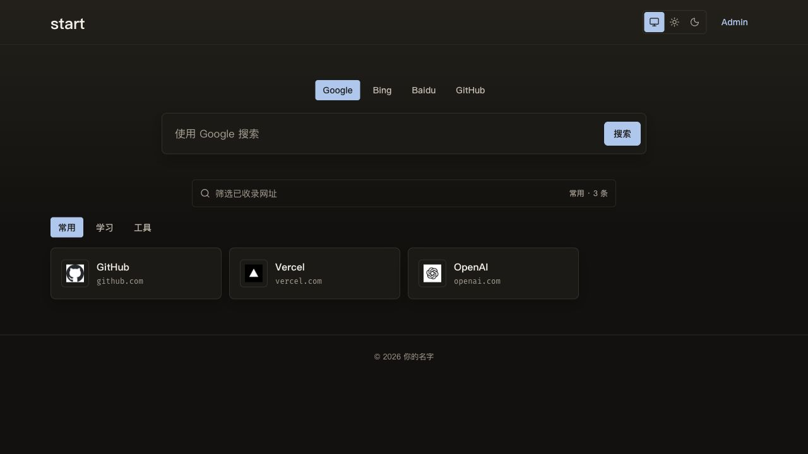
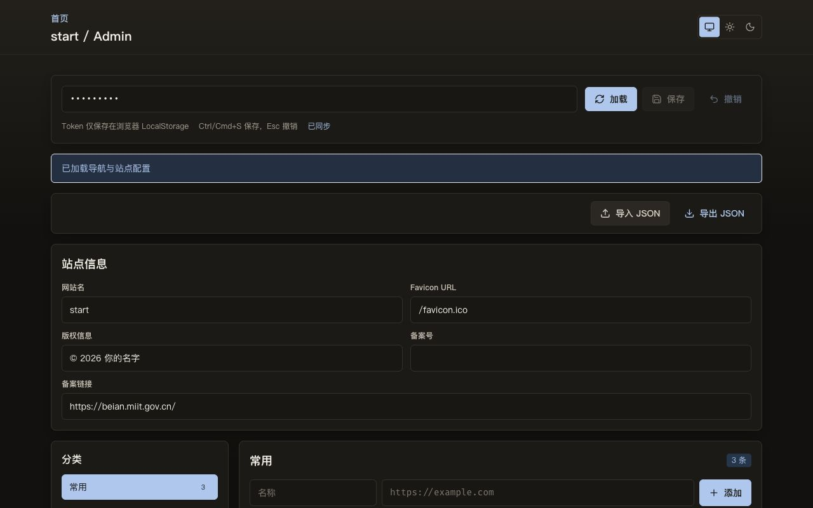

# start

[](https://vercel.com/new/clone?repository-url=https%3A%2F%2Fgithub.com%2Fpanxuc%2Fstart&project-name=start&repository-name=start)

一个安静、轻量、可自托管的一页式网址导航。它基于 Next.js，包含网页搜索、分类导航、favicon 兜底、拼音筛选、深色模式、JSON 导入导出和可视化后台。

演示站：https://start.panxuc.com/

## 功能

- 支持多个搜索引擎。
- 分类网址导航，支持中文、拼音和拼音首字母筛选。
- 支持浅色、深色和跟随系统主题。
- 可视化后台，可管理链接、分类和站点信息。
- 支持 JSON 导入/导出，方便迁移数据。
- 支持三种存储模式：只读配置、Vercel Blob、本地文件。
- 提供 Docker Compose 部署路径，适合 VPS、家用服务器和 NAS。
- 提供 CI、Issue 模板、PR 模板、安全说明和基础测试。

## 截图





## 快速开始

```bash
pnpm install
pnpm dev
```

打开 `http://localhost:3000`。

不配置环境变量也可以直接运行。默认模式是 `START_STORAGE_DRIVER=readonly-config`，会读取 [app/config.tsx](app/config.tsx) 里的内置链接，并禁用后台保存。

## 存储模式

| 模式 | 适合场景 | 读取来源 | 保存目标 |
| --- | --- | --- | --- |
| `readonly-config` | 快速 fork、只想改源码里的默认链接 | [app/config.tsx](app/config.tsx) 和内置站点设置 | 不可保存 |
| `vercel-blob` | Vercel 部署并需要后台可视化编辑 | `NAVIGATION_BLOB_URL`、`SITE_SETTINGS_BLOB_URL` | Vercel Blob |
| `local-file` | Docker、VPS、NAS、自托管 | 磁盘 JSON 文件 | 磁盘 JSON 文件 |

本地开发可以复制 [.env.example](.env.example) 为 `.env.local`。

## Vercel 部署

### 一键部署

点击 README 顶部的 Vercel 按钮即可部署。默认会以只读模式运行，部署后先能看到页面。

### 在 Vercel 上启用后台保存

1. 创建或连接 Vercel Blob。
2. 上传初始数据：
   - [data/navigation.example.json](data/navigation.example.json)
   - [data/site-settings.example.json](data/site-settings.example.json)
3. 设置环境变量：

```bash
START_STORAGE_DRIVER=vercel-blob
NAVIGATION_ADMIN_TOKEN=请换成足够长的随机字符串
BLOB_READ_WRITE_TOKEN=你的 Vercel Blob 读写 Token
NAVIGATION_BLOB_URL=https://你的公开-blob-url/navigation.json
SITE_SETTINGS_BLOB_URL=https://你的公开-blob-url/site-settings.json
```

4. 重新部署。
5. 打开 `/admin`，用 `NAVIGATION_ADMIN_TOKEN` 登录后即可编辑并保存。

## Docker / VPS 部署

准备本地数据文件：

```bash
cp .env.example .env
cp data/navigation.local.example.json data/navigation.local.json
cp data/site-settings.local.example.json data/site-settings.local.json
```

编辑 `.env`：

```bash
START_STORAGE_DRIVER=local-file
NAVIGATION_ADMIN_TOKEN=请换成足够长的随机字符串
NAVIGATION_FILE_PATH=data/navigation.local.json
SITE_SETTINGS_FILE_PATH=data/site-settings.local.json
```

启动：

```bash
docker compose up -d --build
```

打开 `http://localhost:3000`。

`docker-compose.yml` 会把 `./data` 挂载到容器里，后台保存的数据会在重启后保留。

## 环境变量

| 变量 | 是否必需 | 说明 |
| --- | --- | --- |
| `START_STORAGE_DRIVER` | 可选 | `readonly-config`、`vercel-blob` 或 `local-file`。未设置时自动判断，最后回退到 `readonly-config`。 |
| `START_DATA_DIR` | 可选 | 本地文件模式的默认数据目录，默认 `data`。 |
| `NAVIGATION_ADMIN_TOKEN` | 使用后台时必需 | `/admin` 和后台 API 的 Bearer Token，请使用足够长的随机字符串。 |
| `BLOB_READ_WRITE_TOKEN` | Vercel Blob 保存时必需 | Vercel Blob 读写 Token。 |
| `NAVIGATION_BLOB_URL` | Vercel Blob 读取时必需 | `/api/navigation` 读取的公开 JSON URL。 |
| `NAVIGATION_BLOB_PATH` | 可选 | 后台保存导航时覆盖的 Blob 路径，默认 `navigation.json`。 |
| `SITE_SETTINGS_BLOB_URL` | Vercel Blob 读取时必需 | `/api/site-settings` 读取的公开 JSON URL。 |
| `SITE_SETTINGS_BLOB_PATH` | 可选 | 后台保存站点设置时覆盖的 Blob 路径，默认 `site-settings.json`。 |
| `NAVIGATION_FILE_PATH` | 本地文件模式可选 | 导航 JSON 路径，默认 `data/navigation.local.json`。 |
| `SITE_SETTINGS_FILE_PATH` | 本地文件模式可选 | 站点设置 JSON 路径，默认 `data/site-settings.local.json`。 |

## 数据格式

导航 JSON 是“分类名到链接数组”的映射：

```json
{
  "常用": [
    { "name": "GitHub", "url": "https://github.com" },
    { "name": "Vercel", "url": "https://vercel.com" }
  ],
  "学习": [
    { "name": "ArXiv", "url": "https://arxiv.org" }
  ]
}
```

站点设置 JSON：

```json
{
  "siteName": "start",
  "faviconUrl": "/favicon.ico",
  "copyrightText": "你的名字",
  "beianText": "",
  "beianUrl": "https://beian.miit.gov.cn/"
}
```

## 后台

设置 `NAVIGATION_ADMIN_TOKEN` 后打开 `/admin`。

后台可以：

- 新增、编辑、移动和删除链接。
- 新增、重命名、排序和删除分类。
- 编辑站点名称、favicon、版权和备案信息。
- 导入/导出包含导航和站点设置的 JSON 备份。
- 保存到当前配置的存储模式。

Token 登录后只保存在浏览器 `localStorage` 中。

## 后台 API

需要鉴权的接口：

- `GET /api/admin/navigation`
- `PUT /api/admin/navigation`
- `POST /api/admin/navigation`
- `GET /api/admin/site-settings`
- `PUT /api/admin/site-settings`

示例：

```bash
curl -H "Authorization: Bearer $NAVIGATION_ADMIN_TOKEN" \
  https://your-domain.com/api/admin/navigation
```

## 常用命令

```bash
pnpm dev
pnpm lint
pnpm test
pnpm build
pnpm start
```

## Fork 检查清单

1. 修改 [app/config.tsx](app/config.tsx) 中的默认链接，或选择 `vercel-blob` / `local-file` 存储模式。
2. 如果要使用 `/admin`，设置足够强的 `NAVIGATION_ADMIN_TOKEN`。
3. 需要后台保存时，先选择可写的存储模式。
4. 可以通过 `/admin` 导入现有 JSON，也可以直接准备本地数据文件。
5. 发布前运行 `pnpm lint`、`pnpm test` 和 `pnpm build`。

## 贡献

见 [CONTRIBUTING.md](CONTRIBUTING.md)。

## 安全

见 [SECURITY.md](SECURITY.md)。

## 许可证

MIT，见 [LICENSE](LICENSE)。
